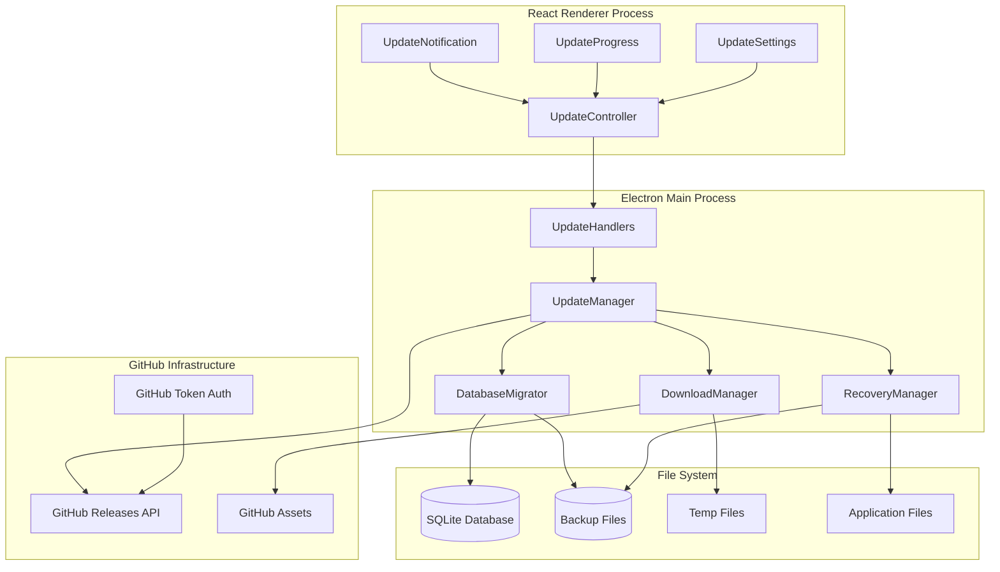
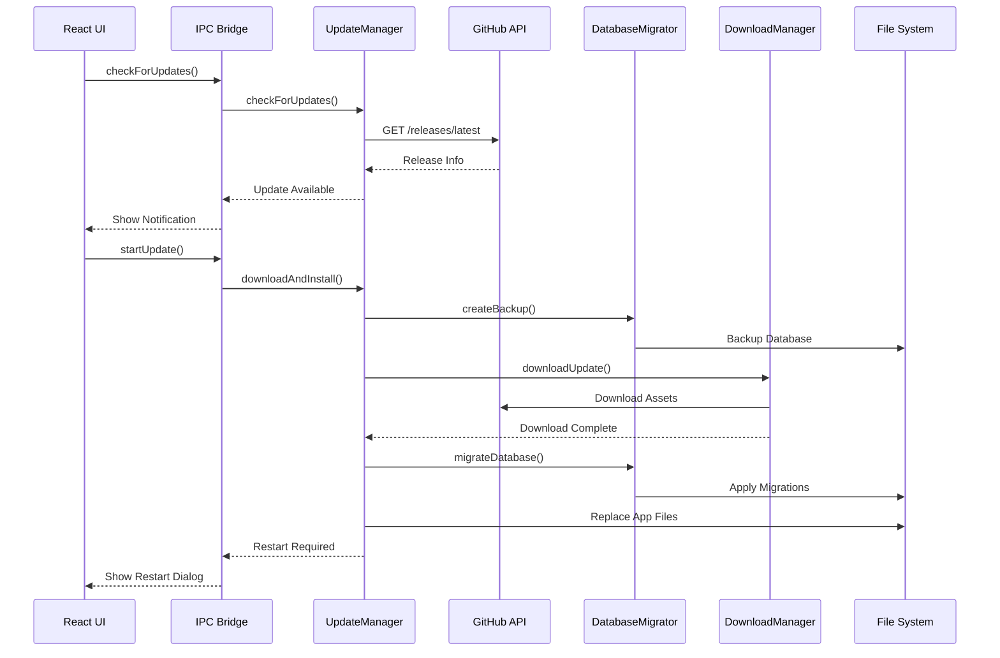

# Puenkaset POS Updater Architecture Design

## Executive Summary

This document provides detailed architectural blueprints for implementing a GitHub Releases-based updater system for the Puenkaset POS application. The design integrates seamlessly with the existing Electron + React + Vite architecture while providing automated, one-click updates with comprehensive database migration and rollback capabilities.

## 1. Component Interaction Architecture

### 1.1 High-Level System Architecture



### 1.2 Update Process Flow



## 2. Detailed File Structure

### 2.1 Updater Module Organization

```
src/
├── main/
│   ├── handlers/
│   │   ├── productHandlers.js          # Existing
│   │   ├── salesHandlers.js            # Existing
│   │   ├── printHandlers.js            # Existing
│   │   ├── backupHandlers.js           # Existing
│   │   └── updateHandlers.js           # NEW - Update IPC handlers
│   ├── services/
│   │   ├── UpdateManager.js            # NEW - Core update orchestration
│   │   ├── DatabaseMigrator.js         # NEW - Database migration logic
│   │   ├── DownloadManager.js          # NEW - File download management
│   │   ├── RecoveryManager.js          # NEW - Rollback and recovery
│   │   └── GitHubService.js            # NEW - GitHub API integration
│   ├── migrations/                     # NEW - Database migration scripts
│   │   ├── index.js                    # Migration registry
│   │   ├── 001_add_remark_column.js    # Example migration
│   │   └── 002_add_cost_price.js       # Example migration
│   └── config/
│       └── update.config.js            # NEW - Update configuration
├── components/
│   ├── common/
│   │   ├── Navigation.jsx              # Existing - Modified for update badge
│   │   ├── Button.jsx                  # Existing
│   │   ├── Toast.jsx                   # Existing
│   │   └── ConfirmModal.jsx            # Existing
│   ├── Update/                         # NEW - Update UI components
│   │   ├── UpdateNotification.jsx      # Update available notification
│   │   ├── UpdateProgress.jsx          # Download/install progress
│   │   ├── UpdateSettings.jsx          # Update preferences
│   │   └── UpdateController.jsx        # Update state management
│   └── Settings/
│       ├── Settings.jsx                # Existing - Modified for update settings
│       ├── BackupSection.jsx           # Existing
│       ├── RestoreSection.jsx          # Existing
│       └── UpdateSection.jsx           # NEW - Update management UI
└── utils/
    ├── updateUtils.js                  # NEW - Update utility functions
    └── versionUtils.js                 # NEW - Version comparison utilities
```

### 2.2 Configuration Files

```
config/
├── update.config.js                    # Update system configuration
├── github.config.js                    # GitHub API configuration
└── migration.config.js                 # Database migration settings

temp/                                    # Temporary update files
├── downloads/                           # Downloaded update packages
├── backups/                            # Database backups
├── staging/                            # Staged files for installation
└── logs/                               # Update process logs
```

## 3. Core Component Specifications

### 3.1 UpdateManager Class Architecture

```javascript
// src/main/services/UpdateManager.js
class UpdateManager {
  constructor() {
    this.currentVersion = app.getVersion();
    this.updateInProgress = false;
    this.downloadPath = path.join(app.getPath('temp'), 'puenkaset-update');
    this.githubService = new GitHubService();
    this.downloadManager = new DownloadManager();
    this.databaseMigrator = new DatabaseMigrator();
    this.recoveryManager = new RecoveryManager();
  }

  // Core Methods
  async checkForUpdates()
  async downloadUpdate(updateInfo)
  async installUpdate()
  async rollbackUpdate()
  async getUpdateStatus()
  async cancelUpdate()

  // Event Handling
  onUpdateProgress(callback)
  onUpdateError(callback)
  onUpdateComplete(callback)

  // Configuration
  setUpdateConfig(config)
  getUpdateConfig()
}
```

**Key Responsibilities:**
- Orchestrate the entire update process
- Coordinate between GitHub API, download, and migration services
- Manage update state and progress reporting
- Handle error conditions and recovery scenarios
- Provide IPC interface for renderer process

**State Management:**
```javascript
const UpdateStates = {
  IDLE: 'idle',
  CHECKING: 'checking',
  UPDATE_AVAILABLE: 'update_available',
  DOWNLOADING: 'downloading',
  DOWNLOADED: 'downloaded',
  INSTALLING: 'installing',
  MIGRATING: 'migrating',
  RESTARTING: 'restarting',
  ERROR: 'error',
  CANCELLED: 'cancelled'
};
```

### 3.2 DatabaseMigrator Component Design

```javascript
// src/main/services/DatabaseMigrator.js
class DatabaseMigrator {
  constructor(dbPath) {
    this.dbPath = dbPath;
    this.backupPath = null;
    this.migrations = [];
  }

  // Migration Management
  async getCurrentSchemaVersion()
  async getTargetSchemaVersion(appVersion)
  async getMigrationsToApply(fromVersion, toVersion)
  async applyMigrations(migrations)
  async rollbackMigrations(migrations)

  // Backup Management
  async createBackup()
  async restoreFromBackup()
  async verifyBackup()
  async cleanupOldBackups()

  // Validation
  async validateDatabaseIntegrity()
  async validateMigrationScripts()
}
```

**Migration Script Structure:**
```javascript
// src/main/migrations/001_add_remark_column.js
export default {
  version: '1.0.1',
  description: 'Add remark column to sales table',
  dependencies: [], // Previous migrations required
  
  up: async (db) => {
    return new Promise((resolve, reject) => {
      db.run("ALTER TABLE sales ADD COLUMN remark TEXT", (err) => {
        if (err) reject(err);
        else resolve();
      });
    });
  },
  
  down: async (db) => {
    // Rollback logic (if possible)
    return Promise.resolve();
  },
  
  validate: async (db) => {
    // Verify migration was applied correctly
    return new Promise((resolve, reject) => {
      db.get("PRAGMA table_info(sales)", (err, result) => {
        if (err) reject(err);
        else resolve(result.some(col => col.name === 'remark'));
      });
    });
  }
};
```

### 3.3 DownloadManager Implementation

```javascript
// src/main/services/DownloadManager.js
class DownloadManager {
  constructor() {
    this.activeDownloads = new Map();
    this.downloadConfig = {
      timeout: 30000,
      retries: 3,
      chunkSize: 1024 * 1024 // 1MB chunks
    };
  }

  // Download Operations
  async downloadFile(url, destination, options = {})
  async resumeDownload(downloadId)
  async cancelDownload(downloadId)
  async verifyDownload(filePath, expectedHash)

  // Progress Tracking
  onProgress(downloadId, callback)
  getDownloadProgress(downloadId)
  
  // Utility Methods
  async calculateFileHash(filePath)
  async extractArchive(archivePath, destination)
  async cleanupDownloads()
}
```

**Download Progress Schema:**
```javascript
interface DownloadProgress {
  downloadId: string;
  url: string;
  destination: string;
  totalBytes: number;
  downloadedBytes: number;
  progress: number; // 0-100
  speed: number; // bytes per second
  eta: number; // estimated time remaining in seconds
  status: 'pending' | 'downloading' | 'paused' | 'completed' | 'error';
  error?: string;
}
```

### 3.4 GitHubService for Private Repository Authentication

```javascript
// src/main/services/GitHubService.js
class GitHubService {
  constructor() {
    this.config = {
      owner: process.env.GITHUB_OWNER || 'your-username',
      repo: process.env.GITHUB_REPO || 'puenkaset',
      token: process.env.GITHUB_TOKEN, // Personal Access Token
      apiBase: 'https://api.github.com'
    };
  }

  // Release Management
  async getLatestRelease()
  async getReleaseByTag(tag)
  async downloadAsset(assetId, destination)
  
  // Authentication
  async validateToken()
  setAuthToken(token)
  
  // Rate Limiting
  async checkRateLimit()
  async waitForRateLimit()
}
```

**Authentication Configuration:**
```javascript
// config/github.config.js
export const githubConfig = {
  // For private repositories, use Personal Access Token
  authentication: {
    type: 'token',
    token: process.env.GITHUB_TOKEN || '', // Set in environment
    scopes: ['repo'] // Required for private repository access
  },
  
  // Repository configuration
  repository: {
    owner: process.env.GITHUB_OWNER || '',
    name: process.env.GITHUB_REPO || 'puenkaset',
    branch: 'main'
  },
  
  // API configuration
  api: {
    baseUrl: 'https://api.github.com',
    timeout: 30000,
    retries: 3
  }
};
```

## 4. IPC Communication Patterns

### 4.1 Update Handler Integration

```javascript
// src/main/handlers/updateHandlers.js
import { ipcMain } from 'electron';
import { UpdateManager } from '../services/UpdateManager.js';

const updateManager = new UpdateManager();

export function setupUpdateHandlers() {
  // Update checking
  ipcMain.handle('update:check', async () => {
    return await updateManager.checkForUpdates();
  });

  // Update download and installation
  ipcMain.handle('update:download', async () => {
    return await updateManager.downloadUpdate();
  });

  ipcMain.handle('update:install', async () => {
    return await updateManager.installUpdate();
  });

  // Progress and status
  ipcMain.handle('update:getStatus', async () => {
    return updateManager.getUpdateStatus();
  });

  ipcMain.handle('update:cancel', async () => {
    return await updateManager.cancelUpdate();
  });

  // Configuration
  ipcMain.handle('update:getConfig', async () => {
    return updateManager.getUpdateConfig();
  });

  ipcMain.handle('update:setConfig', async (event, config) => {
    return updateManager.setUpdateConfig(config);
  });

  // Event forwarding from main to renderer
  updateManager.onUpdateProgress((progress) => {
    BrowserWindow.getAllWindows().forEach(win => {
      win.webContents.send('update:progress', progress);
    });
  });

  updateManager.onUpdateError((error) => {
    BrowserWindow.getAllWindows().forEach(win => {
      win.webContents.send('update:error', error);
    });
  });
}
```

### 4.2 Preload.js Integration

```javascript
// preload.js - Add to existing API
contextBridge.exposeInMainWorld('api', {
  // Existing APIs...
  addProduct: (product) => ipcRenderer.invoke('addProduct', product),
  // ... other existing methods

  // NEW: Update APIs
  updateApi: {
    checkForUpdates: () => ipcRenderer.invoke('update:check'),
    downloadUpdate: () => ipcRenderer.invoke('update:download'),
    installUpdate: () => ipcRenderer.invoke('update:install'),
    getUpdateStatus: () => ipcRenderer.invoke('update:getStatus'),
    cancelUpdate: () => ipcRenderer.invoke('update:cancel'),
    getConfig: () => ipcRenderer.invoke('update:getConfig'),
    setConfig: (config) => ipcRenderer.invoke('update:setConfig', config),
    
    // Event listeners
    onProgress: (callback) => {
      ipcRenderer.on('update:progress', (event, progress) => callback(progress));
    },
    onError: (callback) => {
      ipcRenderer.on('update:error', (event, error) => callback(error));
    },
    
    // Cleanup listeners
    removeAllListeners: () => {
      ipcRenderer.removeAllListeners('update:progress');
      ipcRenderer.removeAllListeners('update:error');
    }
  }
});
```

## 5. React UI Components Design

### 5.1 UpdateNotification Component

```jsx
// src/components/Update/UpdateNotification.jsx
import React, { useState, useEffect } from 'react';

const UpdateNotification = ({ onUpdateStart, onDismiss }) => {
  const [updateInfo, setUpdateInfo] = useState(null);
  const [isVisible, setIsVisible] = useState(false);

  useEffect(() => {
    const checkForUpdates = async () => {
      try {
        const update = await window.api.updateApi.checkForUpdates();
        if (update.available) {
          setUpdateInfo(update);
          setIsVisible(true);
        }
      } catch (error) {
        console.error('Update check failed:', error);
      }
    };

    // Check on component mount
    checkForUpdates();

    // Set up periodic checking (optional)
    const interval = setInterval(checkForUpdates, 24 * 60 * 60 * 1000); // Daily
    return () => clearInterval(interval);
  }, []);

  if (!isVisible || !updateInfo) return null;

  return (
    <div className="update-notification">
      <div className="update-content">
        <h3>อัปเดตใหม่พร้อมใช้งาน</h3>
        <p>เวอร์ชัน {updateInfo.latestVersion} พร้อมให้ดาวน์โหลด</p>
        {updateInfo.releaseNotes && (
          <details>
            <summary>ดูรายละเอียดการอัปเดต</summary>
            <div className="release-notes">
              {updateInfo.releaseNotes}
            </div>
          </details>
        )}
        <div className="update-actions">
          <button 
            className="btn-primary" 
            onClick={() => onUpdateStart(updateInfo)}
          >
            อัปเดตเลย
          </button>
          <button 
            className="btn-secondary" 
            onClick={() => setIsVisible(false)}
          >
            ภายหลัง
          </button>
        </div>
      </div>
    </div>
  );
};

export default UpdateNotification;
```

### 5.2 UpdateProgress Component

```jsx
// src/components/Update/UpdateProgress.jsx
import React, { useState, useEffect } from 'react';

const UpdateProgress = ({ isVisible, onComplete, onError }) => {
  const [progress, setProgress] = useState({
    phase: 'checking',
    progress: 0,
    message: 'กำลังตรวจสอบการอัปเดต...',
    error: null
  });

  useEffect(() => {
    if (!isVisible) return;

    // Listen for progress updates
    window.api.updateApi.onProgress((progressData) => {
      setProgress(progressData);
      
      if (progressData.phase === 'completed') {
        onComplete();
      }
    });

    // Listen for errors
    window.api.updateApi.onError((error) => {
      setProgress(prev => ({ ...prev, error: error.message }));
      onError(error);
    });

    return () => {
      window.api.updateApi.removeAllListeners();
    };
  }, [isVisible, onComplete, onError]);

  if (!isVisible) return null;

  const phaseMessages = {
    checking: 'กำลังตรวจสอบการอัปเดต...',
    downloading: 'กำลังดาวน์โหลดการอัปเดต...',
    installing: 'กำลังติดตั้งการอัปเดต...',
    migrating: 'กำลังอัปเดตฐานข้อมูล...',
    restarting: 'กำลังเริ่มต้นใหม่...'
  };

  return (
    <div className="update-progress-overlay">
      <div className="update-progress-dialog">
        <h3>กำลังอัปเดตแอปพลิเคชัน</h3>
        
        <div className="progress-info">
          <p>{phaseMessages[progress.phase] || progress.message}</p>
          
          <div className="progress-bar">
            <div 
              className="progress-fill" 
              style={{ width: `${progress.progress}%` }}
            />
          </div>
          
          <span className="progress-text">{progress.progress}%</span>
        </div>

        {progress.error && (
          <div className="error-message">
            <p>เกิดข้อผิดพลาด: {progress.error}</p>
            <button onClick={() => window.api.updateApi.cancelUpdate()}>
              ยกเลิก
            </button>
          </div>
        )}

        <p className="update-warning">
          ⚠️ กรุณาอย่าปิดแอปพลิเคชันระหว่างการอัปเดต
        </p>
      </div>
    </div>
  );
};

export default UpdateProgress;
```

### 5.3 UpdateController Component

```jsx
// src/components/Update/UpdateController.jsx
import React, { useState } from 'react';
import UpdateNotification from './UpdateNotification';
import UpdateProgress from './UpdateProgress';

const UpdateController = () => {
  const [updateState, setUpdateState] = useState('idle');
  const [currentUpdate, setCurrentUpdate] = useState(null);

  const handleUpdateStart = async (updateInfo) => {
    setCurrentUpdate(updateInfo);
    setUpdateState('downloading');
    
    try {
      await window.api.updateApi.downloadUpdate();
      await window.api.updateApi.installUpdate();
    } catch (error) {
      console.error('Update failed:', error);
      setUpdateState('error');
    }
  };

  const handleUpdateComplete = () => {
    setUpdateState('completed');
    // App will restart automatically
  };

  const handleUpdateError = (error) => {
    setUpdateState('error');
    console.error('Update error:', error);
  };

  return (
    <>
      <UpdateNotification 
        onUpdateStart={handleUpdateStart}
        onDismiss={() => setUpdateState('dismissed')}
      />
      
      <UpdateProgress 
        isVisible={updateState === 'downloading' || updateState === 'installing'}
        onComplete={handleUpdateComplete}
        onError={handleUpdateError}
      />
    </>
  );
};

export default UpdateController;
```

## 6. Integration with Existing Application

### 6.1 Main.js Integration

```javascript
// main.js - Modified sections
import { app, BrowserWindow } from 'electron';
import path from 'path';
import { fileURLToPath } from 'url';
import process from 'process';
import './db.js';

// Import existing handler modules
import { setupProductHandlers } from './src/main/handlers/productHandlers.js';
import { setupSalesHandlers } from './src/main/handlers/salesHandlers.js';
import { setupPrintHandlers } from './src/main/handlers/printHandlers.js';
import { setupBackupHandlers } from './src/main/handlers/backupHandlers.js';

// NEW: Import update handler
import { setupUpdateHandlers } from './src/main/handlers/updateHandlers.js';

const __filename = fileURLToPath(import.meta.url);
const __dirname = path.dirname(__filename);

function createWindow() {
  const win = new BrowserWindow({
    width: 1200,
    height: 800,
    webPreferences: {
      preload: path.join(__dirname, 'preload.js'),
      nodeIntegration: false,
      contextIsolation: true,
    },
  });

  if (process.env.NODE_ENV === 'development') {
    win.loadURL('http://localhost:5173');
    win.webContents.openDevTools();
  } else {
    win.loadFile('dist/index.html');
  }

  // NEW: Check for updates on window ready
  win.webContents.once('did-finish-load', () => {
    // Delay update check to avoid interfering with app startup
    setTimeout(async () => {
      try {
        const { UpdateManager } = await import('./src/main/services/UpdateManager.js');
        const updateManager = new UpdateManager();
        await updateManager.checkForUpdates();
      } catch (error) {
        console.error('Initial update check failed:', error);
      }
    }, 5000); // 5 second delay
  });
}

// Setup all IPC handlers
function setupHandlers() {
  setupProductHandlers();
  setupSalesHandlers();
  setupPrintHandlers();
  setupBackupHandlers();
  setupUpdateHandlers(); // NEW: Setup update handlers
}

app.whenReady().then(() => {
  setupHandlers();
  createWindow();

  app.on('activate', function () {
    if (BrowserWindow.getAllWindows().length === 0) createWindow();
  });
});

app.on('window-all-closed', function () {
  if (process.platform !== 'darwin') app.quit();
});
```

### 6.2 App.jsx Integration

```jsx
// src/App.jsx - Modified to include UpdateController
import React, { useState } from 'react';
import Navigation from './components/common/Navigation';
import POS from './components/POS/POS';
import ProductManagement from './components/ProductManagement/ProductManagement';
import SalesHistory from './components/SalesHistory/SalesHistory';
import Settings from './components/Settings/Settings';
import UpdateController from './components/Update/UpdateController'; // NEW
import './App.css';

function App() {
  const [currentScreen, setCurrentScreen] = useState('pos');

  const renderScreen = () => {
    switch (currentScreen) {
      case 'pos':
        return <POS />;
      case 'products':
        return <ProductManagement />;
      case 'sales':
        return <SalesHistory />;
      case 'settings':
        return <Settings />;
      default:
        return <POS />;
    }
  };

  return (
    <div className="app-root-layout">
      <Navigation currentScreen={currentScreen} onScreenChange={setCurrentScreen} />
      <div className="app-content">
        {renderScreen()}
      </div>
      
      {/* NEW: Update system integration */}
      <UpdateController />
    </div>
  );
}

export default App;
```

### 6.3 Settings Integration

```jsx
// src/components/Settings/UpdateSection.jsx
import React, { useState, useEffect } from 'react';

const UpdateSection = () => {
  const [updateConfig, setUpdateConfig] = useState({
    autoCheck: true,
    checkInterval: 24, // hours
    autoDownload: false,
    showNotifications: true
  });
  const [currentVersion, setCurrentVersion] = useState('');
  const [isChecking, setIsChecking] = useState(false);

  useEffect(() => {
    loadUpdateConfig();
    setCurrentVersion(require('../../../package.json').version);
  }, []);

  const loadUpdateConfig = async () => {
    try {
      const config = await window.api.updateApi.getConfig();
      setUpdateConfig(config);
    } catch (error) {
      console.error('Failed to load update config:', error);
    }
  };

  const saveUpdateConfig = async (newConfig) => {
    try {
      await window.api.updateApi.setConfig(newConfig);
      setUpdateConfig(newConfig);
    } catch (error) {
      console.error('Failed to save update config:', error);
    }
  };

  const checkForUpdates = async () => {
    setIsChecking(true);
    try {
      const update = await window.api.updateApi.checkForUpdates();
      if (update.available) {
        alert(`อัปเดตใหม่พร้อมใช้งาน: เวอร์ชัน ${update.latestVersion}`);
      } else {
        alert('คุณใช้เวอร์ชันล่าสุดอยู่แล้ว');
      }
    } catch (error) {
      alert('ไม่สามารถตรวจสอบการอัปเดตได้');
    } finally {
      setIsChecking(false);
    }
  };

  return (
    <div className="update-section">
      <h3>การอัปเดตแอปพลิเคชัน</h3>
      
      <div className="version-info">
        <p>เวอร์ชันปัจจุบัน: {currentVersion}</p>
        <button 
          onClick={checkForUpdates} 
          disabled={isChecking}
          className="btn-primary"
        >
          {isChecking ? 'กำลังตรวจสอบ...' : 'ตรวจสอบการอัปเดต'}
        </button>
      </div>

      <div className="update-settings">
        <label>
          <input
            type="checkbox"
            checked={updateConfig.autoCheck}
            onChange={(e) => saveUpdateConfig({
              ...updateConfig,
              autoCheck: e.target.checked
            })}
          />
          ตรวจสอบการอัปเดตอัตโนมัติ
        </label>

        <label>
          <input
            type="checkbox"
            checked={updateConfig.showNotifications}
            onChange={(e) => saveUpdateConfig({
              ...updateConfig,
              showNotifications: e.target.checked
            })}
          />
          แสดงการแจ้งเตือนเมื่อมีอัปเดต
        </label>

        <div className="check-interval">
          <label>ความถี่ในการตรวจสอบ (ชั่วโมง):</label>
          <select
            value={updateConfig.checkInterval}
            onChange={(e) => saveUpdateConfig({
              ...updateConfig,
              checkInterval: parseInt(e.target.value)
            })}
          >
            <option value={1}>ทุกชั่วโมง</option>
            <option value={6}>ทุก 6 ชั่วโมง</option>
            <option value={12}>ทุก 12 ชั่วโมง</option>
            <option value={24}>ทุกวัน</option>
            <option value={168}>ทุกสัปดาห์</option>
          </select>
        </div>
      </div>
    </div>
  );
};

export default UpdateSection;
```

## 7. Configuration Management

### 7.1 Update Configuration

```javascript
// src/main/config/update.config.js
export const updateConfig = {
  // GitHub configuration for private repository
  github: {
    owner: process.env.GITHUB_OWNER || '',
    repo: process.env.GITHUB_REPO || 'puenkaset',
    token: process.env.GITHUB_TOKEN || '', // Personal Access Token
    apiBase: 'https://api.github.com',
    timeout: 30000,
    retries: 3
  },

  // Download configuration
  download: {
    maxRetries: 3,
    retryDelay: 5000,
    chunkSize: 1024 * 1024, // 1MB
    timeout: 300000, // 5 minutes
    verifyChecksum: true
  },

  // Backup configuration
  backup: {
    maxBackups: 5,
    retentionDays: 30,
    compressionLevel: 6,
    verifyBackup: true
  },

  // UI configuration
  ui: {
    autoCheck: true,
    checkInterval: 24 * 60 * 60 * 1000, // 24 hours
    showProgress: true,
    confirmBeforeInstall: true,
    showReleaseNotes: true
  },

  // Security configuration
  security: {
    verifySignatures: false, // Future enhancement
    allowPrerelease: false,
    requireHttps: true
  },

  // Paths configuration
  paths: {
    tempDir: 'temp/puenkaset-update',
    backupDir: 'temp/backups',
    logDir: 'temp/logs'
  }
};
```

### 7.2 Environment Configuration

```javascript
// .env.example
GITHUB_OWNER=your-username
GITHUB_REPO=puenkaset
GITHUB_TOKEN=ghp_xxxxxxxxxxxxxxxxxxxx
NODE_ENV=production
UPDATE_CHECK_INTERVAL=86400000
UPDATE_AUTO_DOWNLOAD=false
```

### 7.3 Migration Configuration

```javascript
// src/main/config/migration.config.js
export const migrationConfig = {
  // Migration settings
  batchSize: 1000, // Records to process per batch
  timeout: 30000, // 30 seconds per migration
  validateAfterMigration: true,
  
  // Backup settings
  createBackupBeforeMigration: true,
  backupRetentionDays: 30,
  
  // Error handling
  stopOnError: true,
  rollbackOnFailure: true,
  
  // Logging
  logMigrations: true,
  logLevel: 'info'
};
```

## 8. Package.json Dependencies and Build Integration

### 8.1 Required Dependencies

```json
{
  "dependencies": {
    "react": "^19.1.0",
    "react-dom": "^19.1.0",
    "sqlite3": "^5.1.6",
    "xlsx": "^0.18.5",
    "semver": "^7.5.4",
    "node-fetch": "^3.3.2",
    "yauzl": "^2.10.0"
  },
  "devDependencies": {
    "@eslint/js": "^9.29.0",
    "@types/react": "^19.1.8",
    "@types/react-dom": "^19.1.6",
    "@vitejs/plugin-react": "^4.5.2",
    "concurrently": "^9.2.0",
    "cross-env": "latest",
    "electron": "^37.2.1",
    "electron-builder": "latest",
    "eslint": "^9.29.0",
    "eslint-plugin-react-hooks": "^5.2.0",
    "eslint-plugin-react-refresh": "^0.4.20",
    "globals": "^16.2.0",
    "vite": "^7.0.0",
    "wait-on": "^8.0.3"
  }
}
```

### 8.2 Build Configuration Updates

```json
{
  "build": {
    "appId": "com.puenkaset.pos",
    "mac": {
      "target": "dmg"
    },
    "win": {
      "target": "nsis"
    },
    "nsis": {
      "oneClick": false,
      "allowToChangeInstallationDirectory": true
    },
    "productName": "Puenkaset",
    "files": [
      "dist/**/*",
      "main.js",
      "preload.js",
      "db.js",
      "store.db",
      "src/main/handlers/**/*",
      "src/main/services/**/*",
      "src/main/migrations/**/*",
      "src/main/config/**/*"
    ],
    "directories": {
      "buildResources": "public"
    },
    "asarUnpack": [
      "store.db",
      "src/main/migrations/**/*"
    ],
    "publish": {
      "provider": "github",
      "owner": "your-username",
      "repo": "puenkaset",
      "private": true,
      "token": "${GITHUB_TOKEN}"
    }
  }
}
```

### 8.3 GitHub Actions Workflow

```yaml
# .github/workflows/release.yml
name: Build and Release

on:
  push:
    tags:
      - 'v*'

jobs:
  build:
    runs-on: windows-latest
    
    steps:
    - uses: actions/checkout@v3
    
    - name: Setup Node.js
      uses: actions/setup-node@v3
      with:
        node-version: '18'
        cache: 'npm'
    
    - name: Install dependencies
      run: npm ci
    
    - name: Build application
      run: npm run build
    
    - name: Build Electron app
      run: npm run dist
      env:
        GITHUB_TOKEN: ${{ secrets.GITHUB_TOKEN }}
    
    - name: Create Release
      uses: softprops/action-gh-release@v1
      with:
        files: dist/*.exe
        draft: false
        prerelease: false
      env:
        GITHUB_TOKEN: ${{ secrets.GITHUB_TOKEN }}
```

## 9. Update Workflow and State Management

### 9.1 Update State Machine

```javascript
// src/main/services/UpdateStateMachine.js
export class UpdateStateMachine {
  constructor() {
    this.state = 'idle';
    this.transitions = {
      idle: ['checking'],
      checking: ['update_available', 'no_update', 'error'],
      update_available: ['downloading', 'cancelled'],
      downloading: ['downloaded', 'error', 'cancelled'],
      downloaded: ['installing', 'cancelled'],
      installing: ['migrating', 'error'],
      migrating: ['restarting', 'error'],
      restarting: ['completed'],
      error: ['idle', 'retrying'],
      cancelled: ['idle']
    };
  }

  canTransition(newState) {
    return this.transitions[this.state]?.includes(newState) || false;
  }

  transition(newState, data = {}) {
    if (!this.canTransition(newState)) {
      throw new Error(`Invalid transition from ${this.state} to ${newState}`);
    }
    
    const previousState = this.state;
    this.state = newState;
    
    this.emit('stateChange', {
      from: previousState,
      to: newState,
      data
    });
  }
}
```

### 9.2 Update Workflow Orchestration

```javascript
// src/main/services/UpdateWorkflow.js
export class UpdateWorkflow {
  constructor(updateManager) {
    this.updateManager = updateManager;
    this.stateMachine = new UpdateStateMachine();
    this.currentUpdate = null;
    this.progress = { phase: 'idle', progress: 0, message: '' };
  }

  async executeUpdateWorkflow(updateInfo) {
    try {
      this.currentUpdate = updateInfo;
      
      // Phase 1: Pre-update validation
      await this.validatePreConditions();
      
      // Phase 2: Download
      this.stateMachine.transition('downloading');
      await this.downloadPhase();
      
      // Phase 3: Pre-installation backup
      this.stateMachine.transition('installing');
      await this.backupPhase();
      
      // Phase 4: Installation
      await this.installationPhase();
      
      // Phase 5: Database migration
      this.stateMachine.transition('migrating');
      await this.migrationPhase();
      
      // Phase 6: Restart
      this.stateMachine.transition('restarting');
      await this.restartPhase();
      
      this.stateMachine.transition('completed');
      
    } catch (error) {
      this.stateMachine.transition('error', { error });
      await this.handleError(error);
      throw error;
    }
  }

  async validatePreConditions() {
    // Check disk space
    const requiredSpace = this.currentUpdate.fileSize * 2; // Download + extraction
    const availableSpace = await this.getAvailableDiskSpace();
    
    if (availableSpace < requiredSpace) {
      throw new Error('Insufficient disk space for update');
    }

    // Check network connectivity
    await this.verifyNetworkConnectivity();
    
    // Validate GitHub token
    await this.validateGitHubAccess();
  }

  async downloadPhase() {
    this.updateProgress('downloading', 0, 'เริ่มดาวน์โหลดการอัปเดต...');
    
    const downloadPath = await this.updateManager.downloadManager.downloadFile(
      this.currentUpdate.downloadUrl,
      this.getDownloadPath(),
      (progress) => {
        this.updateProgress('downloading', progress.progress, 
          `กำลังดาวน์โหลด... ${progress.downloadedBytes}/${progress.totalBytes} bytes`);
      }
    );

    // Verify download integrity
    await this.verifyDownloadIntegrity(downloadPath);
    
    this.updateProgress('downloading', 100, 'ดาวน์โหลดเสร็จสิ้น');
  }

  async backupPhase() {
    this.updateProgress('installing', 10, 'กำลังสำรองข้อมูล...');
    
    await this.updateManager.databaseMigrator.createBackup();
    await this.createApplicationBackup();
    
    this.updateProgress('installing', 30, 'สำรองข้อมูลเสร็จสิ้น');
  }

  async installationPhase() {
    this.updateProgress('installing', 40, 'กำลังติดตั้งไฟล์ใหม่...');
    
    // Extract and stage new files
    await this.extractUpdateFiles();
    
    this.updateProgress('installing', 70, 'กำลังแทนที่ไฟล์แอปพลิเคชัน...');
    
    // Replace application files atomically
    await this.replaceApplicationFiles();
    
    this.updateProgress('installing', 90, 'ติดตั้งเสร็จสิ้น');
  }

  async migrationPhase() {
    this.updateProgress('migrating', 0, 'กำลังอัปเดตฐานข้อมูล...');
    
    const currentVersion = await this.getCurrentDatabaseVersion();
    const targetVersion = this.currentUpdate.version;
    
    await this.updateManager.databaseMigrator.migrate(currentVersion, targetVersion);
    
    this.updateProgress('migrating', 100, 'อัปเดตฐานข้อมูลเสร็จสิ้น');
  }

  async restartPhase() {
    this.updateProgress('restarting', 0, 'กำลังเริ่มต้นแอปพลิเคชันใหม่...');
    
    // Schedule restart
    setTimeout(() => {
      app.relaunch();
      app.exit(0);
    }, 2000);
  }

  updateProgress(phase, progress, message) {
    this.progress = { phase, progress, message };
    this.emit('progress', this.progress);
  }
}
```

## 10. Error Handling and Recovery Procedures

### 10.1 Error Classification and Handling

```javascript
// src/main/services/ErrorHandler.js
export class UpdateErrorHandler {
  constructor(recoveryManager) {
    this.recoveryManager = recoveryManager;
    this.errorTypes = {
      NETWORK_ERROR: 'network',
      DOWNLOAD_ERROR: 'download',
      FILESYSTEM_ERROR: 'filesystem',
      DATABASE_ERROR: 'database',
      INSTALLATION_ERROR: 'installation',
      MIGRATION_ERROR: 'migration',
      AUTHENTICATION_ERROR: 'authentication'
    };
  }

  async handleError(error, context = {}) {
    const errorType = this.classifyError(error);
    const recovery = this.getRecoveryStrategy(errorType, context);
    
    console.error(`Update error [${errorType}]:`, error);
    
    try {
      await recovery.execute();
      return { recovered: true, strategy: recovery.name };
    } catch (recoveryError) {
      console.error('Recovery failed:', recoveryError);
      return { recovered: false, error: recoveryError };
    }
  }

  classifyError(error) {
    if (error.code === 'ENOTFOUND' || error.code === 'ETIMEDOUT') {
      return this.errorTypes.NETWORK_ERROR;
    }
    
    if (error.message.includes('GitHub') || error.status === 401) {
      return this.errorTypes.AUTHENTICATION_ERROR;
    }
    
    if (error.code === 'ENOSPC' || error.code === 'EACCES') {
      return this.errorTypes.FILESYSTEM_ERROR;
    }
    
    if (error.message.includes('database') || error.message.includes('migration')) {
      return this.errorTypes.DATABASE_ERROR;
    }
    
    return this.errorTypes.INSTALLATION_ERROR;
  }

  getRecoveryStrategy(errorType, context) {
    const strategies = {
      [this.errorTypes.NETWORK_ERROR]: new NetworkErrorRecovery(),
      [this.errorTypes.DOWNLOAD_ERROR]: new DownloadErrorRecovery(),
      [this.errorTypes.FILESYSTEM_ERROR]: new FilesystemErrorRecovery(),
      [this.errorTypes.DATABASE_ERROR]: new DatabaseErrorRecovery(this.recoveryManager),
      [this.errorTypes.INSTALLATION_ERROR]: new InstallationErrorRecovery(this.recoveryManager),
      [this.errorTypes.MIGRATION_ERROR]: new MigrationErrorRecovery(this.recoveryManager),
      [this.errorTypes.AUTHENTICATION_ERROR]: new AuthenticationErrorRecovery()
    };
    
    return strategies[errorType] || new DefaultErrorRecovery();
  }
}
```

### 10.2 Recovery Strategies

```javascript
// src/main/services/RecoveryStrategies.js
export class DatabaseErrorRecovery {
  constructor(recoveryManager) {
    this.recoveryManager = recoveryManager;
    this.name = 'Database Error Recovery';
  }

  async execute() {
    console.log('Executing database error recovery...');
    
    // Stop any ongoing database operations
    await this.stopDatabaseOperations();
    
    // Restore from backup
    await this.recoveryManager.restoreDatabaseFromBackup();
    
    // Verify database integrity
    await this.verifyDatabaseIntegrity();
    
    console.log('Database recovery completed');
  }
}

export class InstallationErrorRecovery {
  constructor(recoveryManager) {
    this.recoveryManager = recoveryManager;
    this.name = 'Installation Error Recovery';
  }

  async execute() {
    console.log('Executing installation error recovery...');
    
    // Restore application files from backup
    await this.recoveryManager.restoreApplicationFiles();
    
    // Clean up temporary files
    await this.recoveryManager.cleanupTemporaryFiles();
    
    // Verify application integrity
    await this.verifyApplicationIntegrity();
    
    console.log('Installation recovery completed');
  }
}

export class MigrationErrorRecovery {
  constructor(recoveryManager) {
    this.recoveryManager = recoveryManager;
    this.name = 'Migration Error Recovery';
  }

  async execute() {
    console.log('Executing migration error recovery...');
    
    // Rollback database to pre-migration state
    await this.recoveryManager.rollbackDatabase();
    
    // Restore previous application version
    await this.recoveryManager.restoreApplicationFiles();
    
    // Verify rollback success
    await this.verifyRollbackSuccess();
    
    console.log('Migration recovery completed');
  }
}
```

### 10.3 Recovery Manager

```javascript
// src/main/services/RecoveryManager.js
export class RecoveryManager {
  constructor() {
    this.backupPaths = {
      database: null,
      application: null,
      configuration: null
    };
  }

  async createFullBackup() {
    const timestamp = new Date().toISOString().replace(/[:.]/g, '-');
    
    // Backup database
    this.backupPaths.database = await this.backupDatabase(timestamp);
    
    // Backup application files
    this.backupPaths.application = await this.backupApplicationFiles(timestamp);
    
    // Backup configuration
    this.backupPaths.configuration = await this.backupConfiguration(timestamp);
    
    return this.backupPaths;
  }

  async restoreDatabaseFromBackup() {
    if (!this.backupPaths.database) {
      throw new Error('No database backup available for restoration');
    }
    
    const dbPath = path.join(process.cwd(), 'store.db');
    await fs.copyFile(this.backupPaths.database, dbPath);
    
    // Verify restoration
    await this.verifyDatabaseIntegrity();
  }

  async restoreApplicationFiles() {
    if (!this.backupPaths.application) {
      throw new Error('No application backup available for restoration');
    }
    
    // Extract backup and restore files
    await this.extractAndRestoreFiles(this.backupPaths.application);
  }

  async rollbackDatabase() {
    console.log('Rolling back database changes...');
    
    // Close current database connections
    await this.closeDatabaseConnections();
    
    // Restore from backup
    await this.restoreDatabaseFromBackup();
    
    // Reopen database connections
    await this.reopenDatabaseConnections();
  }

  async cleanupTemporaryFiles() {
    const tempDir = path.join(app.getPath('temp'), 'puenkaset-update');
    
    try {
      await fs.rm(tempDir, { recursive: true, force: true });
    } catch (error) {
      console.warn('Failed to cleanup temporary files:', error);
    }
  }

  async verifyRecoverySuccess() {
    // Verify database is accessible and intact
    await this.verifyDatabaseIntegrity();
    
    // Verify application files are correct
    await this.verifyApplicationIntegrity();
    
    // Verify configuration is valid
    await this.verifyConfigurationIntegrity();
    
    return true;
  }
}
```

## 11. Security Considerations for Private Repository

### 11.1 GitHub Token Management

```javascript
// src/main/services/SecurityManager.js
export class SecurityManager {
  constructor() {
    this.tokenValidationCache = new Map();
    this.tokenExpiryTime = 24 * 60 * 60 * 1000; // 24 hours
  }

  async validateGitHubToken(token) {
    // Check cache first
    const cached = this.tokenValidationCache.get(token);
    if (cached && Date.now() - cached.timestamp < this.tokenExpiryTime) {
      return cached.valid;
    }

    try {
      const response = await fetch('https://api.github.com/user', {
        headers: {
          'Authorization': `token ${token}`,
          'User-Agent': 'Puenkaset-POS-Updater'
        }
      });

      const isValid = response.ok;
      
      // Cache result
      this.tokenValidationCache.set(token, {
        valid: isValid,
        timestamp: Date.now()
      });

      return isValid;
    } catch (error) {
      console.error('Token validation failed:', error);
      return false;
    }
  }

  async validateRepositoryAccess(owner, repo, token) {
    try {
      const response = await fetch(`https://api.github.com/repos/${owner}/${repo}`, {
        headers: {
          'Authorization': `token ${token}`,
          'User-Agent': 'Puenkaset-POS-Updater'
        }
      });

      return response.ok;
    } catch (error) {
      console.error('Repository access validation failed:', error);
      return false;
    }
  }

  async secureTokenStorage(token) {
    // In production, consider using electron-store with encryption
    // or Windows Credential Manager / macOS Keychain
    const { safeStorage } = require('electron');
    
    if (safeStorage.isEncryptionAvailable()) {
      return safeStorage.encryptString(token);
    }
    
    // Fallback: basic obfuscation (not secure)
    return Buffer.from(token).toString('base64');
  }

  async retrieveSecureToken(encryptedToken) {
    const { safeStorage } = require('electron');
    
    if (safeStorage.isEncryptionAvailable()) {
      return safeStorage.decryptString(encryptedToken);
    }
    
    // Fallback: decode obfuscated token
    return Buffer.from(encryptedToken, 'base64').toString();
  }
}
```

### 11.2 Download Verification

```javascript
// src/main/services/DownloadVerifier.js
export class DownloadVerifier {
  async verifyDownloadIntegrity(filePath, expectedHash, algorithm = 'sha256') {
    const actualHash = await this.calculateFileHash(filePath, algorithm);
    
    if (actualHash !== expectedHash) {
      throw new Error(`Download verification failed. Expected: ${expectedHash}, Got: ${actualHash}`);
    }
    
    return true;
  }

  async calculateFileHash(filePath, algorithm = 'sha256') {
    const crypto = require('crypto');
    const fs = require('fs');
    
    return new Promise((resolve, reject) => {
      const hash = crypto.createHash(algorithm);
      const stream = fs.createReadStream(filePath);
      
      stream.on('data', (data) => hash.update(data));
      stream.on('end', () => resolve(hash.digest('hex')));
      stream.on('error', reject);
    });
  }

  async verifyFileSignature(filePath, signaturePath) {
    // Future enhancement: implement digital signature verification
    // This would require code signing certificates
    console.log('Digital signature verification not implemented yet');
    return true;
  }
}
```

## 12. Implementation Guidelines and Next Steps

### 12.1 Implementation Priority

**Phase 1: Core Infrastructure (Week 1-2)**
1. Set up GitHub service with private repository authentication
2. Implement basic UpdateManager with update checking
3. Create DatabaseMigrator with backup functionality
4. Set up IPC handlers and preload integration

**Phase 2: Download and Installation (Week 3-4)**
1. Implement DownloadManager with progress tracking
2. Add file verification and integrity checking
3. Create installation and file replacement logic
4. Implement basic UI notifications

**Phase 3: Advanced Features (Week 5-6)**
1. Add comprehensive error handling and recovery
2. Implement rollback mechanisms
3. Create update progress UI components
4. Add update settings and configuration

**Phase 4: Testing and Polish (Week 7-8)**
1. Comprehensive testing of all update scenarios
2. Error scenario testing and recovery validation
3. UI/UX improvements and polish
4. Documentation and deployment preparation

### 12.2 Testing Strategy

**Unit Testing:**
- Update detection and version comparison
- Database migration scripts
- Download progress calculation
- Error handling scenarios

**Integration Testing:**
- GitHub API integration with authentication
- Database migration end-to-end
- File download and verification
- IPC communication between main and renderer

**End-to-End Testing:**
- Complete update process simulation
- Failure scenario testing with recovery
- Performance testing with large updates
- User experience testing

### 12.3 Deployment Checklist

**GitHub Repository Setup:**
- [ ] Configure GitHub Actions for automated builds
- [ ] Set up release workflow with asset generation
- [ ] Configure repository secrets for tokens
- [ ] Test private repository access

**Application Configuration:**
- [ ] Set up environment variables for GitHub credentials
- [ ] Configure update check intervals
- [ ] Set up logging and error reporting
- [ ] Test update configuration in development

**Security Setup:**
- [ ] Generate and configure GitHub Personal Access Token
- [ ] Implement secure token storage
- [ ] Set up download verification
- [ ] Test authentication and authorization

**Build Process:**
- [ ] Update electron-builder configuration
- [ ] Test automated build and release process
- [ ] Verify asset generation and upload
- [ ] Test update detection from releases

This comprehensive architecture provides a robust foundation for implementing the GitHub Releases-based updater system for the Puenkaset POS application, with full support for private repositories, automated updates, database migrations, and comprehensive error handling and recovery capabilities.